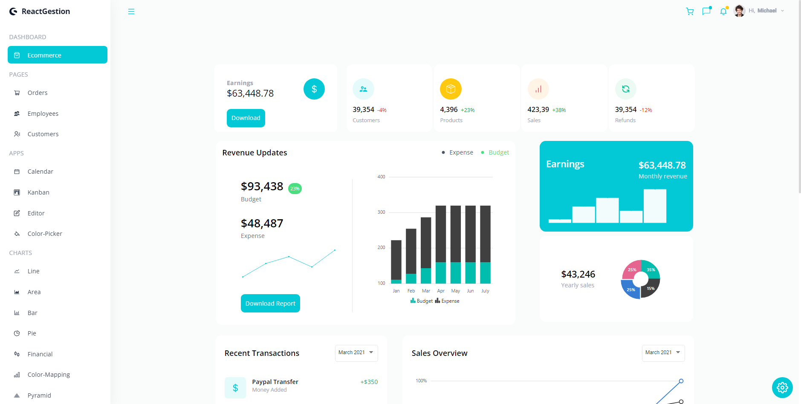

<a name="readme-top"></a>

<div align="center">
  <br/>
  <br/>
  <br/>
  <!-- You are encouraged to replace this logo with your own! Otherwise you can also remove it. -->
  
  <br/>
  <br/>
  <br/>
  <br/>

  <h1><b>ReactGestion</b></h1>

  ## 📷 Screenshots

  


</div>

<!-- TABLE OF CONTENTS -->

# 📗 Table of Contents

- [📗 Table of Contents](#-table-of-contents)
- [📖 ReactGestion](#-monsters-of-code-2023)
  - [🛠 Built With ](#-built-with-)
    - [Tech Stack ](#tech-stack-)
    - [Key Features ](#key-features-)
  - [🚀 Live Demo ](#-live-demo-)
  - [💻 Getting Started ](#-getting-started-)
    - [Prerequisites](#prerequisites)
    - [Setup](#setup)
    - [Install](#install)
    - [Usage](#usage)
    - [Run tests](#run-tests)
    - [Deployment](#deployment)
  - [👥 Authors ](#-authors-)
  - [🔭 Future Features ](#-future-features-)
  - [Walkthrough ](#walkthrough-)
  - [🤝 Contributing ](#-contributing-)
  - [⭐️ Show your support ](#️-show-your-support-)
  - [🙏 Acknowledgments ](#-acknowledgments-)
  - [📝 License ](#-license-)

<!-- PROJECT DESCRIPTION -->

# 📖 ReactGestion<a name="about-project"></a>

This project is about an administrator panel that can be used as a base for more specific projects, it has a modern and elegant user interface, it includes some applications, messaging and alerts system, a calendar, kanban board, and a collection of fully functional graphics charts to fit different needs.

## 🛠 Built With <a name="built-with"></a>

### Tech Stack <a name="tech-stack"></a>

- React
- Redux

<details>
  <summary>Client</summary>
  - React<br>
- Redux<br>
</details>

<details>
  <summary>Server</summary>
    - Node.js
</details>

<details>
<summary>Database</summary>
    - Postrgres
</details>

### Key Features <a name="key-features"></a>

- **Responsive Design**

<!-- LIVE DEMO -->

## 🚀 Live Demo <a name="live-demo"></a>

- Coming soon

<!-- - No live demo available yet -->
<p align="right">(<a href="#readme-top">back to top</a>)</p>

<!-- GETTING STARTED -->

## 💻 Getting Started <a name="getting-started"></a>

To get a local copy up and running, follow these steps.

### Prerequisites

- A web browser
- A code editor
- A terminal

### Setup

Clone this repository to your desired folder:

```sh
  git clone https://github.com/SergioPeralta22/React-Admin-App.git

### Install

Install this project with:

```sh
  cd client
  npm install
```

### Usage

To run the project, execute the following command:

```sh
  npm run dev
```

### Run tests

To run tests, run the following command:

- no tests available

<!--
Example command:

```sh
  bin/rails test test/models/article_test.rb
```
--->

### Deployment

You can deploy this project using:

```sh
npm run predeploy
npm run deploy

```

<p align="right">(<a href="#readme-top">back to top</a>)</p>

<!-- AUTHORS -->

## 👥 Authors <a name="authors"></a>

👤 Sergio Peralta

- GitHub: [@SergioPeralta22](https://github.com/SergioPeralta22)
- Twitter: [@SePeralta22](https://twitter.com/SePeralta22)
- LinkedIn: [LinkedIn](https://linkedin.com/in/sergioperalta22)

## 🔭 Future Features <a name="future-features"></a>

- **Add more applications**
- **Add more graphics**
- **Add more pages**

## Walkthrough <a name="walkthrough"></a>


<!-- CONTRIBUTING -->

## 🤝 Contributing <a name="contributing"></a>

Contributions, issues, and feature requests are welcome!

<p align="right">(<a href="#readme-top">back to top</a>)</p>

<!-- SUPPORT -->

## ⭐️ Show your support <a name="support"></a>

If you like this project, give it a ⭐️!

<p align="right">(<a href="#readme-top">back to top</a>)</p>


<p align="right">(<a href="#readme-top">back to top</a>)</p>

<!-- LICENSE -->

## 📝 License <a name="license"></a>

This project is [MIT](./LICENSE) licensed.

<p align="right">(<a href="#readme-top">back to top</a>)</p>
